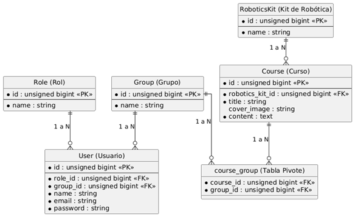

# Sistema Escolar de Robótica 🤖

**Nombre del Proyecto:** activity7 (Actividad 7 y Tarea 6)

## Descripción del Proyecto
Plataforma web desarrollada en Laravel para la gestión administrativa y académica de una escuela de robótica. Este sistema está diseñado para facilitar la impartición de clases mediante la administración estructurada de los siguientes elementos:

* **Usuarios y Roles:** Gestión de accesos para tres tipos de usuarios (Administrativo, Profesor y Estudiante).
* **Grupos de Aprendizaje:** Asignación de estudiantes a grupos por niveles (Principiante, Intermedio, Avanzado).
* **Catálogo de Cursos:** Administración de cursos, cada uno con su título, imagen de portada y contenido detallado.
* **Kits de Robótica:** Vinculación de material didáctico específico (como StarterKit, Educational Robotics Kit y Kit5) a los cursos correspondientes.

El proyecto incluye el modelado completo de la base de datos utilizando el ORM **Eloquent**, con migraciones, relaciones (1 a N y N a M), así como la automatización de datos de prueba mediante **Seeders** (usuarios base y kits) y **Factories** (generación masiva de 100 cursos con Faker).

## Diagrama Entidad-Relación (ER)
A continuación se muestra el modelo relacional de la base de datos que sustenta el sistema:

---
*Proyecto desarrollado para la Actividad 7 y Tarea 6.*